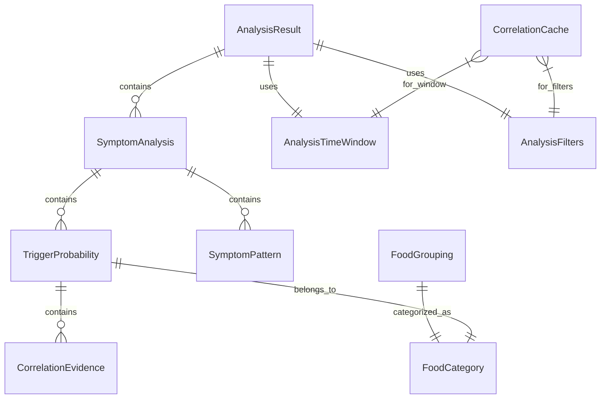

# Data Model: Improved Analysis Insights

**Feature**: Symptom-centric trigger analysis with probability-based correlations  
**Date**: 2025-10-26  
**Purpose**: Define data entities and relationships for enhanced correlation analysis

## Core Entities

### AnalysisResult
**Purpose**: Represents the complete analysis output for a specific time period and filter set

```kotlin
data class AnalysisResult(
    val id: String = UUID.randomUUID().toString(),
    val generatedAt: Instant,
    val analysisTimeWindow: AnalysisTimeWindow,
    val filters: AnalysisFilters,
    val symptomAnalyses: List<SymptomAnalysis>,
    val totalSymptomOccurrences: Int,
    val totalFoodEntries: Int,
    val observationPeriodDays: Int,
    val reliabilityScore: Double // Overall confidence in the analysis
)
```

**Validation Rules**:
- `generatedAt` must not be in the future
- `symptomAnalyses` must not be empty if `totalSymptomOccurrences > 0`
- `reliabilityScore` must be between 0.0 and 1.0
- `observationPeriodDays` must be positive

**Relationships**:
- Contains multiple `SymptomAnalysis` entities
- References `AnalysisTimeWindow` and `AnalysisFilters`

### SymptomAnalysis
**Purpose**: Analysis results for a specific symptom type, containing its potential triggers

```kotlin
data class SymptomAnalysis(
    val id: String = UUID.randomUUID().toString(),
    val symptomType: String,
    val totalOccurrences: Int,
    val averageIntensity: Double,
    val severityLevel: SeverityLevel,
    val triggerProbabilities: List<TriggerProbability>,
    val patterns: List<SymptomPattern>,
    val confidence: Double,
    val recommendationLevel: RecommendationLevel,
    val lastOccurrence: Instant?,
    val insights: List<String> // Plain-language insights
)

enum class SeverityLevel { LOW, MEDIUM, HIGH }
enum class RecommendationLevel { 
    HIDE,           // Don't show - insufficient data
    LOW_CONFIDENCE, // Show with warnings
    MEDIUM,         // Show as potential pattern
    HIGH            // Show as likely pattern
}
```

**Validation Rules**:
- `totalOccurrences` must be positive
- `averageIntensity` must be between 1.0 and 10.0
- `confidence` must be between 0.0 and 1.0
- `triggerProbabilities` must be sorted by probability descending
- If `recommendationLevel` is HIDE, `triggerProbabilities` should be empty

**Relationships**:
- Contains multiple `TriggerProbability` entities
- Contains multiple `SymptomPattern` entities
- Belongs to one `AnalysisResult`

### TriggerProbability
**Purpose**: Represents the calculated probability that a specific food triggered symptoms

```kotlin
data class TriggerProbability(
    val id: String = UUID.randomUUID().toString(),
    val foodName: String,
    val foodCategory: FoodCategory,
    val probability: Double, // 0.0 to 1.0
    val probabilityPercentage: Int, // 0 to 100 (display value)
    val confidence: Double,
    val occurrenceCount: Int,
    val correlationScore: Double,
    val temporalScore: Double,
    val baselineScore: Double,
    val frequencyScore: Double,
    val averageTimeLag: Duration, // Average time between food and symptom
    val intensityMultiplier: Double,
    val lastCorrelationDate: Instant,
    val supportingEvidence: List<CorrelationEvidence>
)

enum class FoodCategory(val displayName: String, val baselineProbability: Double) {
    DAIRY("Dairy", 0.65),
    GLUTEN("Gluten", 0.45),
    FODMAP_HIGH("High FODMAP", 0.75),
    CAFFEINE("Caffeine", 0.55),
    ALCOHOL("Alcohol", 0.60),
    SPICY("Spicy Foods", 0.50),
    FATTY("Fatty Foods", 0.58),
    ARTIFICIAL_SWEETENERS("Artificial Sweeteners", 0.70),
    CITRUS("Citrus", 0.40),
    BEANS_LEGUMES("Beans & Legumes", 0.52),
    OTHER("Other", 0.30)
}
```

**Validation Rules**:
- `probability` and `confidence` must be between 0.0 and 1.0
- `probabilityPercentage` must be between 0 and 100
- `probabilityPercentage` should equal `(probability * 100).toInt()`
- `occurrenceCount` must be positive
- `averageTimeLag` must be positive and ≤ 8 hours
- All score components (`correlationScore`, `temporalScore`, etc.) must be between 0.0 and 1.0

**Relationships**:
- Belongs to one `SymptomAnalysis`
- Contains multiple `CorrelationEvidence` entities
- References `FoodCategory` enum

### CorrelationEvidence
**Purpose**: Specific instances that support a food-symptom correlation

```kotlin
data class CorrelationEvidence(
    val id: String = UUID.randomUUID().toString(),
    val foodTimestamp: Instant,
    val symptomTimestamp: Instant,
    val timeLag: Duration,
    val symptomIntensity: Int,
    val foodQuantity: String?,
    val temporalWeight: Double,
    val contextualNotes: String?
)
```

**Validation Rules**:
- `symptomTimestamp` must be after `foodTimestamp`
- `timeLag` must equal the difference between timestamps
- `symptomIntensity` must be between 1 and 10
- `temporalWeight` must be between 0.0 and 1.0

### SymptomPattern
**Purpose**: Represents recurring patterns in symptom-trigger relationships

```kotlin
data class SymptomPattern(
    val id: String = UUID.randomUUID().toString(),
    val patternType: PatternType,
    val description: String,
    val frequency: Double, // How often this pattern occurs (0.0 to 1.0)
    val strength: Double,  // How strong the pattern is (0.0 to 1.0)
    val involvedFoods: List<String>,
    val averageTimeLag: Duration,
    val occurrenceCount: Int,
    val confidence: Double,
    val insights: List<String>
)

enum class PatternType {
    SINGLE_TRIGGER,     // One food consistently triggers symptoms
    COMBINATION_TRIGGER, // Multiple foods together trigger symptoms  
    DOSAGE_DEPENDENT,   // Amount of food affects symptom severity
    TIME_DEPENDENT,     // Time of day affects correlation
    CUMULATIVE_EFFECT   // Build-up over multiple days
}
```

**Validation Rules**:
- `frequency`, `strength`, and `confidence` must be between 0.0 and 1.0
- `occurrenceCount` must be positive
- `involvedFoods` must not be empty
- `averageTimeLag` must be positive and ≤ 8 hours

### AnalysisTimeWindow
**Purpose**: Defines the time period for correlation analysis

```kotlin
data class AnalysisTimeWindow(
    val startDate: LocalDate,
    val endDate: LocalDate,
    val windowSizeHours: Int = 8, // How far back to look for triggers
    val minimumOccurrences: Int = 3,
    val minimumObservationDays: Int = 14
) {
    fun isValid(): Boolean {
        return endDate.isAfter(startDate) && 
               windowSizeHours > 0 && 
               minimumOccurrences > 0 && 
               minimumObservationDays > 0
    }
    
    fun totalDays(): Int = ChronoUnit.DAYS.between(startDate, endDate).toInt()
}
```

### AnalysisFilters
**Purpose**: User-selected filters for customizing analysis scope

```kotlin
data class AnalysisFilters(
    val severityThreshold: Int? = null, // Minimum symptom intensity (1-10)
    val symptomTypes: Set<String> = emptySet(), // Specific symptoms to analyze
    val foodCategories: Set<FoodCategory> = emptySet(), // Specific food types
    val excludeFoods: Set<String> = emptySet(), // Foods to exclude from analysis
    val minimumConfidence: Double = 0.3, // Minimum confidence to show results
    val showLowOccurrenceCorrelations: Boolean = false
) {
    fun isEmpty(): Boolean {
        return severityThreshold == null && 
               symptomTypes.isEmpty() && 
               foodCategories.isEmpty() && 
               excludeFoods.isEmpty() &&
               minimumConfidence <= 0.3 &&
               !showLowOccurrenceCorrelations
    }
}
```

## Supporting Entities

### CorrelationCache
**Purpose**: Cache calculated correlations to avoid expensive recalculation

```kotlin
@Entity(tableName = "correlation_cache")
data class CorrelationCache(
    @PrimaryKey val id: String = UUID.randomUUID().toString(),
    val foodName: String,
    val symptomType: String,
    val correlationScore: Double,
    val confidence: Double,
    val calculatedAt: Instant,
    val dataHashCode: Int, // Hash of source data to detect changes
    val filters: String,   // JSON serialized filters
    val timeWindow: String, // JSON serialized time window
    val isValid: Boolean = true
)
```

**Validation Rules**:
- `correlationScore` and `confidence` must be between 0.0 and 1.0
- `calculatedAt` must not be in the future
- Cache entries should be invalidated when source data changes

### FoodGrouping
**Purpose**: Maps individual foods to categories for analysis

```kotlin
@Entity(tableName = "food_groupings")
data class FoodGrouping(
    @PrimaryKey val id: String = UUID.randomUUID().toString(),
    val foodName: String,
    val normalizedName: String, // Cleaned, lowercase version
    val category: FoodCategory,
    val confidence: Double, // How confident we are in the categorization
    val source: GroupingSource, // How this grouping was determined
    val lastUpdated: Instant,
    val isUserConfirmed: Boolean = false // User has verified this grouping
)

enum class GroupingSource {
    KEYWORD_MATCH,    // Matched known keywords
    SIMILARITY,       // Similar to existing categorized food
    USER_DEFINED,     // User manually categorized
    ML_PREDICTION     // Future: Machine learning classification
}
```

## Entity Relationships



## State Transitions

### AnalysisResult Lifecycle
1. **Requested** → Analysis parameters defined
2. **Calculating** → Background correlation computation
3. **Generated** → Results available for display
4. **Cached** → Results stored for reuse
5. **Invalidated** → Source data changed, needs recalculation

### TriggerProbability Reliability
1. **Insufficient** → Too few occurrences (`RecommendationLevel.HIDE`)
2. **Low** → Some data but uncertain (`RecommendationLevel.LOW_CONFIDENCE`)
3. **Medium** → Reasonable confidence (`RecommendationLevel.MEDIUM`)
4. **High** → Strong statistical support (`RecommendationLevel.HIGH`)

## Data Integration

### Existing Entities Extended
The analysis system integrates with existing Room entities:

- **FoodItem** → Source for food consumption data
- **Symptom** → Source for symptom occurrence data  
- **User preferences** → Default analysis filters

### New Repository Methods
```kotlin
interface AnalysisRepository {
    suspend fun generateAnalysis(
        timeWindow: AnalysisTimeWindow,
        filters: AnalysisFilters
    ): AnalysisResult
    
    suspend fun getCachedAnalysis(
        timeWindow: AnalysisTimeWindow,
        filters: AnalysisFilters
    ): AnalysisResult?
    
    suspend fun invalidateCache(since: Instant)
    
    fun observeAnalysisResults(): Flow<AnalysisResult?>
}
```

This data model provides the foundation for sophisticated symptom-trigger analysis while maintaining clean separation between calculation logic and presentation concerns.